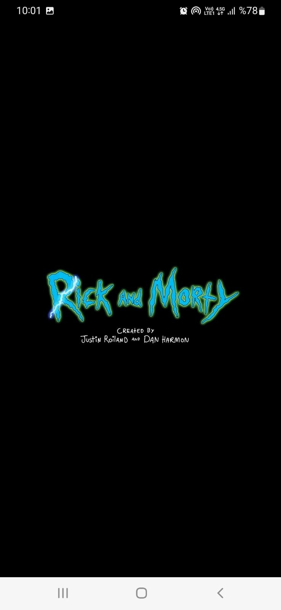
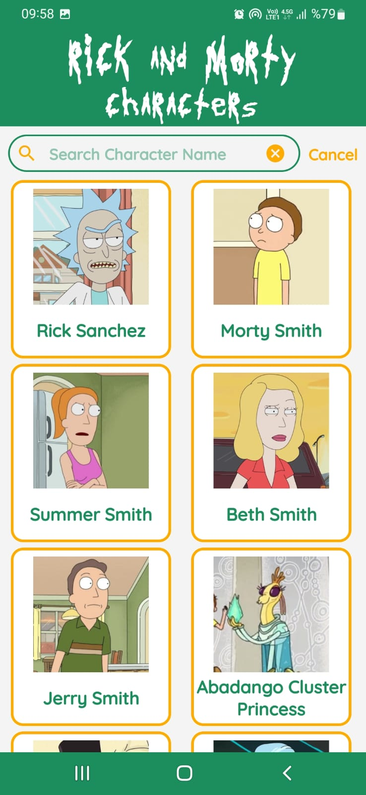
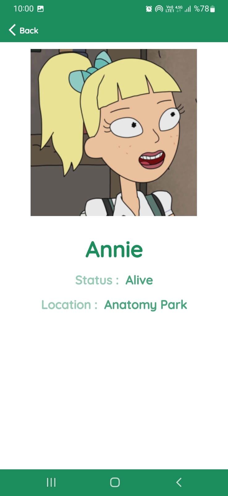
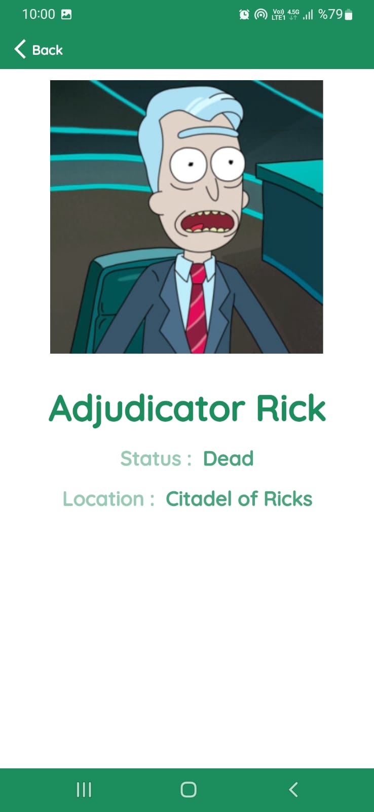
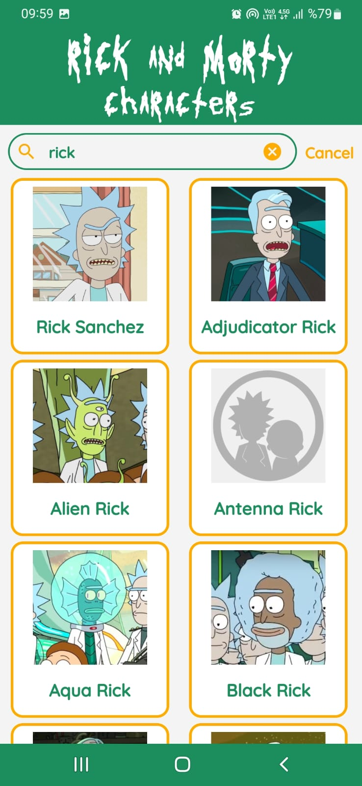
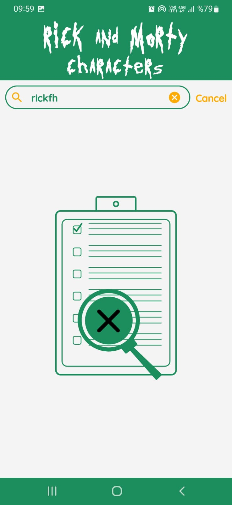

# RickAndMorty

### Project Information

- The first activity lists rick and morty characters. You can also find characters by searching.

- In the second activity, more detailed information about the characters can be accessed.

### Techs.

-Java
 
-Retrofit

-Picasso

-DataBinding  
 
-Recyclerview-Cardview

-Lottie

-Videoview

-Clean Code

 
<a id="raw-url" href="https://raw.githubusercontent.com/SefaKoyuncu/RickAndMorty/master/rickandmortycharacters.apk">Download APK Here</a>

------------
#### Screenshots
  
<table>
  <tr>
    <td></td>
    <td></td>
    <td></td>
      <td></td>
  </tr>
 </table>
 
  

<table>
  <tr>
    <td></td>
    <td></td>
      <td></td>
    <td></td>

  </tr>
 </table>
 
  

------------
